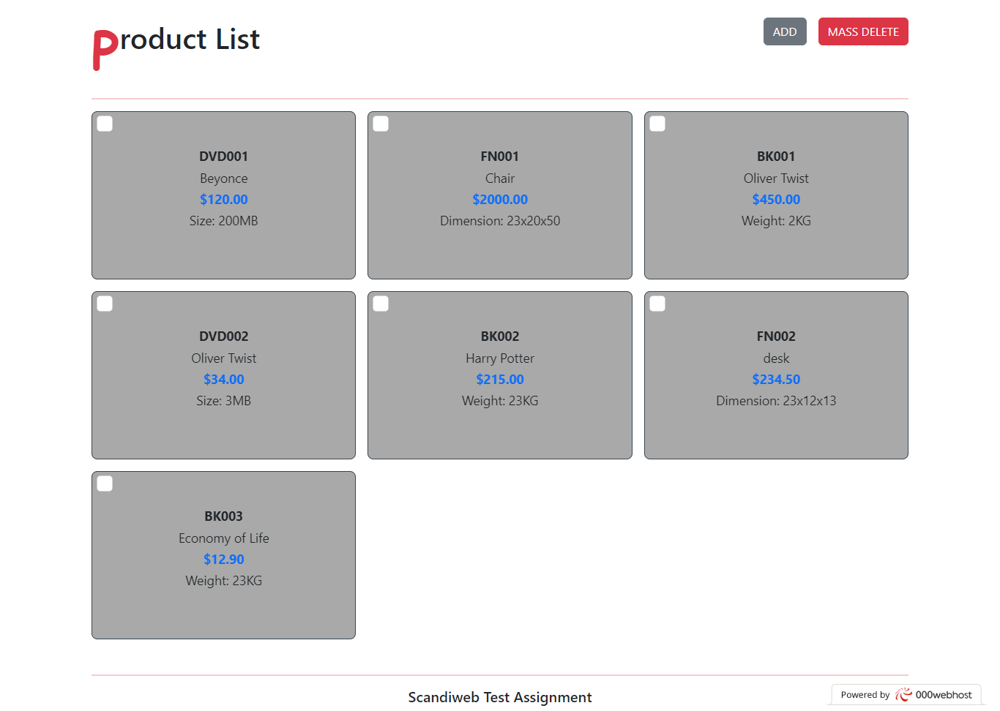
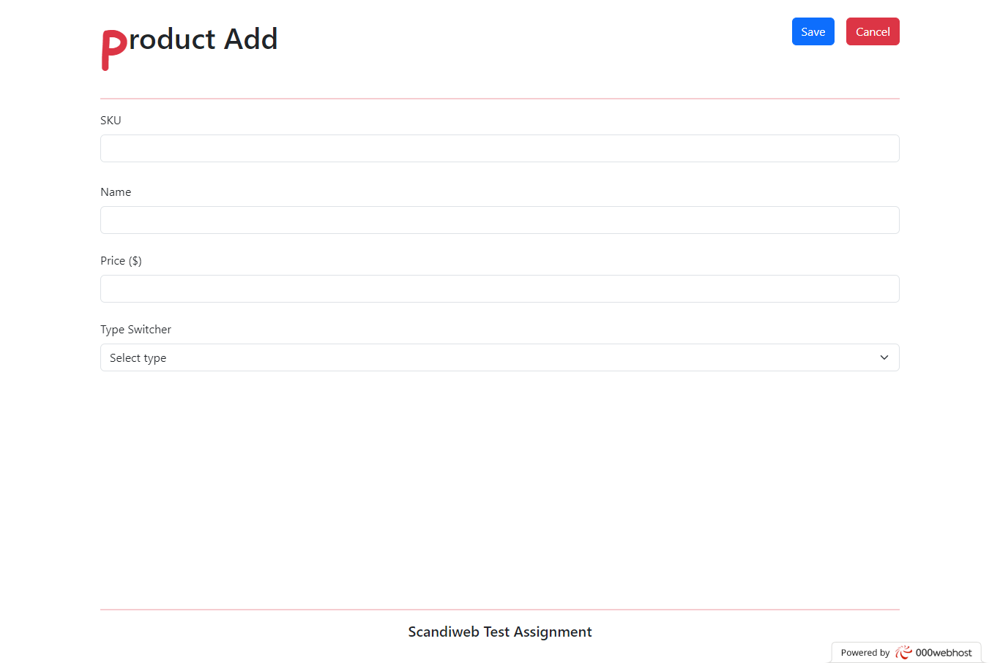

  

  <h3 align="center">Scandiweb Test Assessment</h3>

  

    Welcome to My Scandiweb Junior Developer test assignment!
     
    <a href="https://scandidds.000webhostapp.com/">View Demo</a>
    |
    <a href="https://github.com/didds088/scandiweb/issues">Report Bug</a>
    |
    <a href="https://github.com/didds088/scandiweb/issues">Request Feature</a>
  

<!-- ABOUT THE PROJECT -->
## About The Project

The is an E-commerce web-app containing two pages
* A Product page 
* An Add product page

<figure class="image">
  
    
  <figcaption align="center">Product Page</figcaption>
</figure>

### PRODUCT PAGE
The product page displays products from data fetched from the database, it also contains a Mass 
Delete button that deletes products selected by checking the checkboxes, it allows multiple selections and deletion.
It also has an Add button that navigate user to the Add Product page.  

### ADD PRODUCT PAGE
The page displays a form that adds new product to the database

<figure class="image">
  
    
  <figcaption align="center">Add Product Page</figcaption>
</figure>

## Built With

* [![React][React.js]][React-url]
* [![Animate][animate.style]][Animate-url]
* [![Php][Php.net]][Php-url]
* [![Bootstrap][Bootstrap.com]][Bootstrap-url]
* [![Javascript][Javascript.com]][JavaScript-url]

(<a href="#readme-top">back to top</a>)

### Custom Hooks
* useHandleInputs: handles inputs form inputs from the add products page.
* useDeleteproducts: handles the deletion of products
* useFetchProducts: fetch products
* useAddProducts: add new products to database

### Components
* Products: displays products from database.
* SkeletonCards: uses react-loading-skeleton

<!-- CONTACT -->
## Contact

Kingsley Agusiobo - agusiobokingsley@outlook.com

(<a href="#readme-top">back to top</a>)

<!-- MARKDOWN LINKS & IMAGES -->
<!-- https://www.markdownguide.org/basic-syntax/#reference-style-links -->
[product]: src/img/product.png
[add]: src/img/add.png
[React.js]: https://img.shields.io/badge/React-20232A?style=for-the-badge&logo=react&logoColor=61DAFB
[React-url]: https://reactjs.org/
[Animate.style]: https://img.shields.io/badge/animate.style-35495E?style=for-the-badge&logo=vuedotjs&logoColor=4FC08D
[Animate-url]: https://animate.style/
[Php.net]: https://img.shields.io/badge/php-%23777BB4.svg?style=for-the-badge&logo=php&logoColor=white
[Php-url]: https://php.net
[Bootstrap.com]: https://img.shields.io/badge/Bootstrap-563D7C?style=for-the-badge&logo=bootstrap&logoColor=white
[Bootstrap-url]: https://getbootstrap.com
[Javascript.com]: https://img.shields.io/badge/javascript-%23323330.svg?style=for-the-badge&logo=javascript&logoColor=%23F7DF1E
[Javascript-url]: https://jquery.com 
